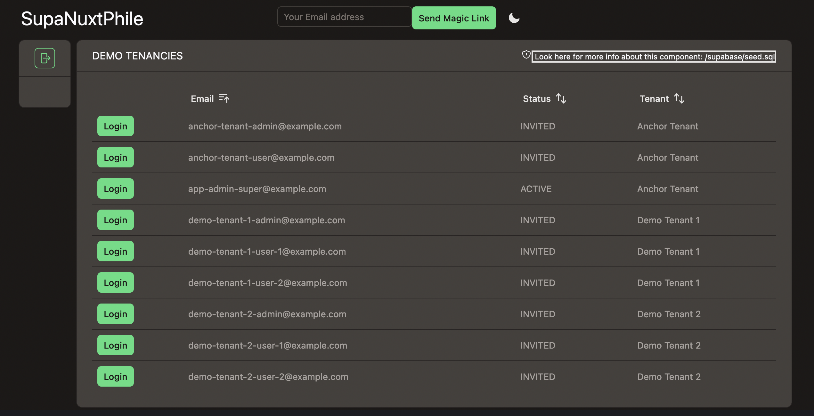

# Demo Data
By default, the stack is configured to support OTP magic-link login with **PKCE flow**

This is to provide zero friction in getting your app started quickly.

You can login as any of the listed users.  This process leverages the Supabase InBucket server at https://localhost:54324.

The intention is that this component and demo data will be removed as your project moves toward a real scenario.

A more robust auth integration is left to the developer, if desired.

Try logging in as different users.  The most interesting is **app-admin-super@example.com**